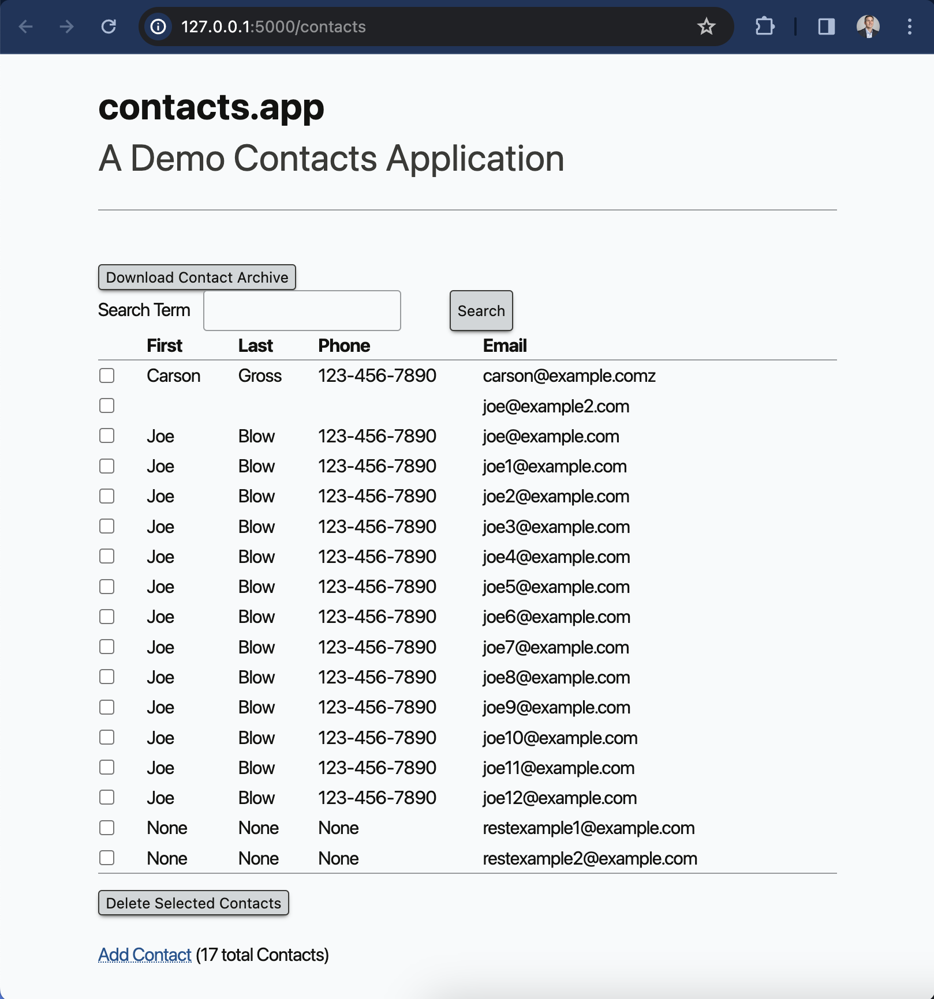
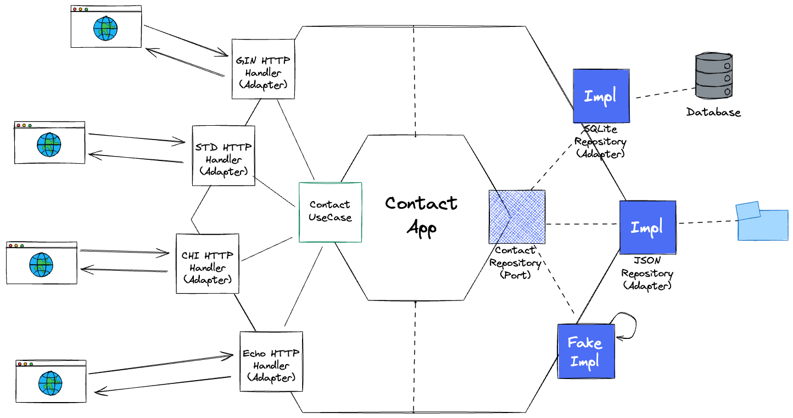

# HTMX Contact App - Go Version

This is an attempt to convert the [python based contact app](https://github.com/bigskysoftware/contact-app) from the [Hypermedia Systems Book](https://hypermedia.systems/book/contents/) into a Go version using different frameworks.

It is also loosely created with the hexagonal architecture in order to provide multiple examples using different Go frameworks.

This initial version includes a single repository (json) and a single framework (Gin) and is not yet complete (still working through the book!).

It is not suggested that this is the correct way to create an app necessarily, it's just been created as closely to the original as is reasonable as an exercise for comparison. The domain model can largely be ignored with the focus being on how to implement htmx in the various Go frameworks.

## Structure

Frontend

* `templates` - html templates slightly modified from the Python copies for Go use
* `static` - css etc. (direct copy from Python version)

Contacts App

* `internal/domain` - contains the contacts domain model
* `internal/ports` - contact use case and repository interfaces
* `internal/usecases` - the contact use case implementation
* `internal/repositories` - the contact repository implementations
* `internal/cache` - helper module for providing a cache for the json repository

Backend

* `cmd/htmx-gin` - Gin implementation

## Usage

Clone the repository and use the following commands for each of the frameworks:

* Gin
  *  `go run ./cmd/htmx-gin`

## To Do

* Implement additional Go web frameworks
* Implement additional repository options
* Embed templates
* Add tests
* Any kind of error checking 🙄
* Code documentation

## Contributions

Feel free to contribute additional examples or suggest modifications in general.